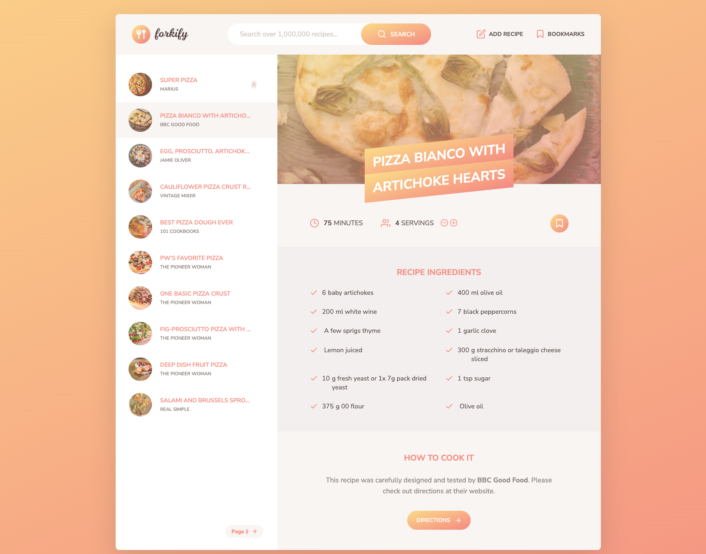

# Forkify

[](#)
> A web application for searching, viewing, and managing recipes, featuring custom recipe creation, bookmarking, and a clean, responsive design.

## Overview

**Forkify** is a web application that allows users to search for recipes, view detailed cooking instructions, and manage their favorite meals. The app integrates with a third-party API to fetch over a million recipes, providing real-time search results with images, preparation times, and serving sizes.

## Preview

<p align="center">
  
</p>

## Features

- **Search recipes** by keyword using a third-party API.
- **View detailed** cooking instructions and ingredient lists.
- **Add custom recipes** with images and cooking details.
- **Bookmark and manage** favorite recipes.
- **Responsive design** for desktop and mobile users.
- **State management and page updates** without reloading using the MVC (Model-View-Controller) architecture.

## Live Demo

**Explore the live version here:** [View Live Demo](https://marius-recipes.netlify.app/)

## Local Setup

1. **Clone** the repository:
   ```bash
   git clone https://github.com/MIBogdan/marius-recipes.git
   ```
2. **Open** the `index.html` file in your browser
   *- or use a local development server (like VS Code Live Server) for a smoother development experience.*

3. **Install** dependencies:
   ```bash
   npm install
   ```

4. **Run** the application:
   ```bash
   npm start
   ```
- The development server will open automatically in your default browser.
- **If it doesn't open automatically**,manually visit: http://localhost:3000 in your browser.

5. **Terminate** the server:
- **On macOS/Linux:** Press `Control + C` in the terminal. 
- **On Windows:** Press `Ctrl + C` in the Command Prompt or PowerShell. 
---

## Author

**Marius Bogdan**  
[Personal portfolio](https://marius-bogdan.com/)

Feel free to reach out for any questions or collaborations!

## License

This project is provided for testing and demonstration purposes only. All rights are reserved. No part of this project may be redistributed, reuploaded, or used in any manner (commercially or otherwise) without explicit written permission from the author.
